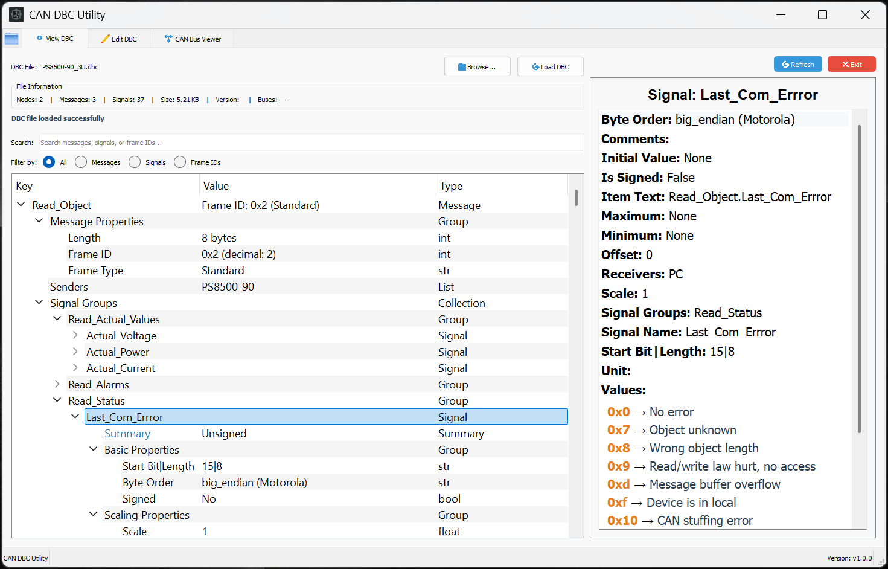

<div align="center">
  
  <h1>DBC Utility</h1>
</div>

A simple PyQt5-based GUI application for viewing, editing, and managing CAN (Controller Area Network) DBC files.

## Features

- **DBC File Viewer**: Browse and inspect CAN messages and signals in a tree structure
- **DBC File Editor**: Full-featured editor for modifying messages and signals
- **Advanced Search**: Unified search functionality with filters for messages, signals, and frame IDs

- **Signal Management**: Add, edit, and delete both messages and signals
- **File Management**: Load, save, and save-as functionality for DBC files
- **Modern UI**: Clean, intuitive interface with proper icons and status indicators

## Screenshots

### View Tab - DBC File Browser

*Browse and inspect CAN messages and signals in a hierarchical tree structure*

### Edit Tab - DBC File Editor

*Full-featured editor for modifying messages and signals with intuitive controls*

## Project Structure

```
dbcUtility/
├── main.py                # Main application entry point
├── src/                   # Source code directory
│   ├── DBCUtility.py      # Main application logic
│   ├── dbc_editor.py      # Core DBC file processing logic
│   ├── dbc_editor_ui.py   # User interface components
│   └── search_module.py   # Unified search functionality
├── scripts/               # Build and utility scripts
│   ├── build_exe.py       # Windows PyInstaller build script
│   ├── build_linux.py     # Linux distribution build script
│   ├── release.py         # Windows release script
│   ├── release_linux.py   # Linux release script
│   ├── clean_build.py     # Clean build directories
│   └── make_executable.py # Make build scripts executable
├── docs/                  # Documentation
│   └── LINUX_BUILD_SETUP.md # Linux build setup guide
├── requirements.txt       # Python dependencies
├── icons/                 # Application icons
├── images/                # Screenshots for README
├── tests/                 # Test files and utilities
└── README.md
```

## Installation

### Windows
1. **Clone the repository**:
   ```bash
   git clone <repository-url>
   cd dbcUtility
   ```

2. **Install UV** (if not already installed):
   ```bash
   # Using pip
   pip install uv
   
   # Or using the standalone installer (recommended)
   # Visit https://github.com/astral-sh/uv for installation instructions
   ```

3. **Install dependencies using UV**:
   ```bash
   uv sync
   ```

4. **Run the application**:
   ```bash
   # Using UV
   uv run dbcUtility
   ```

### Linux
1. **Download Linux Distribution** (recommended):
   - Download `DBCUtility-Linux-x86_64-v1.0.0.tar.gz` from releases
   - Extract: `tar -xzf DBCUtility-Linux-x86_64-v1.0.0.tar.gz`
   - Install: `cd DBCUtility-Linux-x86_64-v1.0.0 && ./install.sh`

2. **Download AppImage** (alternative):
   - Download `DBCUtility-Linux-x86_64-v1.0.0.AppImage` from releases
   - Make executable: `chmod +x DBCUtility-Linux-x86_64-v1.0.0.AppImage`
   - Run: `./DBCUtility-Linux-x86_64-v1.0.0.AppImage`

3. **Build from source**:
   ```bash
   git clone <repository-url>
   cd dbcUtility
   
   # Using UV (recommended)
   uv sync
   uv run python main.py
   
   # Or using pip (legacy)
   pip install -r requirements.txt
   python main.py
   ```

4. **Build Linux Distribution** (for distribution):
   ```bash
   # Using UV (recommended)
   uv run python scripts/build_linux.py
   
   # Or using regular Python
   python scripts/build_linux.py
   
   # See docs/LINUX_BUILD_SETUP.md for detailed instructions
   ```

5. **Create Complete Release**:
   ```bash
   # Using UV (recommended)
   uv run python scripts/release_linux.py
   
   # Or using regular Python
   python scripts/release_linux.py
   ```

## Dependencies

- **PyQt5** (≥5.15.0) - GUI framework
- **cantools** (≥40.0.0) - DBC file parsing and manipulation
- **pyinstaller** (≥5.0.0) - For creating executables

### Third-Party Licenses

This project uses the following third-party libraries:

#### PyQt5
- **License**: GPL v3 or Commercial License
- **Copyright**: © 2020 The Qt Company Ltd.
- **Website**: https://www.riverbankcomputing.com/software/pyqt/
- **Note**: PyQt5 is licensed under GPL v3. If you distribute this application, you must comply with the GPL v3 license terms.

#### Cantools
- **License**: MIT License
- **Copyright**: © 2015-2024 Erik Moqvist
- **Repository**: https://github.com/cantools/cantools

#### PyInstaller
- **License**: GPL v2 with exception
- **Copyright**: © 2005-2024 PyInstaller Development Team
- **Repository**: https://github.com/pyinstaller/pyinstaller

## Usage

### Main Interface
The application provides a tabbed interface with three main sections:

1. **View Tab**: Browse DBC files in a tree structure (see screenshot above)
2. **Edit Tab**: Full editing capabilities for messages and signals (see screenshot above)


### Key Features

#### DBC File Operations
- **Load DBC**: Open and parse DBC files using cantools
- **Save Changes**: Save modifications back to DBC format
- **Save As**: Save to a new file location

#### Message Management
- **Add Messages**: Create new CAN messages with custom properties
- **Edit Messages**: Modify message name, frame ID, length, and other properties
- **Delete Messages**: Remove messages from the DBC file

#### Signal Management
- **Add Signals**: Create new signals within messages
- **Edit Signals**: Modify signal properties (start bit, length, scale, offset, etc.)
- **Delete Signals**: Remove signals from messages

#### Search and Filter
- **Unified Search**: Search across messages, signals, and frame IDs
- **Filter Options**: Filter by message type, signal type, or frame ID
- **Real-time Filtering**: Instant search results as you type


- **Customizable Output**: Configure export format and options

## Development

### Code Structure

- **`main.py`**: Main application entry point
- **`src/DBCUtility.py`**: Main application with PyQt5 window management
- **`src/dbc_editor.py`**: Core DBC processing using cantools library
- **`src/dbc_editor_ui.py`**: UI components and dialog boxes
- **`src/search_module.py`**: Search and filtering functionality

### Building the Executable

To build the executable for distribution:

**Using UV (recommended):**
```bash
uv run python scripts/build_exe.py
```

**Using regular Python:**
```bash
python scripts/build_exe.py
```

The executable will be created in the `dist/` directory.

### Creating a Release

To create a complete release package:

**Using UV (recommended):**
```bash
# Windows release
uv run python scripts/release.py

# Linux release
uv run python scripts/release_linux.py
```

**Using regular Python:**
```bash
# Windows release
python scripts/release.py

# Linux release
python scripts/release_linux.py
```

This will:
- Build the executable
- Create a versioned release package
- Include all necessary documentation
- Generate release notes

The release package will be created in:
- Windows: `release-v{version}/` directory
- Linux: `release-linux-v{version}/` directory

**Note**: Release packages are not included in the git repository. They are created locally and should be uploaded to GitHub releases separately.

#### Complete Release Workflow with UV

Here's a step-by-step guide for creating release packages using UV:

1. **Ensure dependencies are synced:**
   ```bash
   uv sync
   ```

2. **Create Windows Release:**
   ```bash
   # This will build the executable and create a complete release package
   uv run python scripts/release.py
   ```
   The release will be in `release-v{version}/` with:
   - `DBCUtility-v{version}.exe` - The executable
   - `DBCUtility-v{version}.zip` - Complete package
   - Documentation files (README.md, LICENSE, CHANGELOG.md)
   - `RELEASE_NOTES.txt` - Release notes

3. **Create Linux Release:**
   ```bash
   # This will build the Linux distribution and create a complete release package
   uv run python scripts/release_linux.py
   ```
   The release will be in `release-linux-v{version}/` with:
   - `DBCUtility-Linux-{arch}-v{version}/` - Distribution folder
   - `DBCUtility-Linux-{arch}-v{version}.tar.gz` - Tar package
   - `DBCUtility-Linux-{arch}-v{version}.AppImage` - AppImage (if appimagetool is available)
   - Documentation and release notes

4. **Upload to GitHub:**
   - Create a new release on GitHub
   - Upload the release packages
   - Include the release notes from the generated files

### Testing

The `tests/` directory contains various test files for:
- DBC file parsing and saving
- UI component testing
- Signal and message manipulation
- Comment handling

## License

This project is licensed under the GNU General Public License v3 (GPL v3) - see the [LICENSE](LICENSE) file for details.

### GPL v3 Compliance

This application is licensed under GPL v3, which means:

- **Freedom to Use**: You can use the software for any purpose
- **Freedom to Study**: You can examine how the software works
- **Freedom to Modify**: You can change the software to suit your needs
- **Freedom to Distribute**: You can share the software with others
- **Copyleft**: Any derivative works must also be licensed under GPL v3

### Distribution Requirements

When distributing this application or any derivative works, you must:

- Make the source code available to recipients
- Provide a copy of the GPL v3 license
- Notify recipients of their rights under GPL v3
- Include clear attribution to the original authors

### License Summary

- **DBC Utility**: GPL v3
- **PyQt5**: GPL v3 (compatible)
- **Cantools**: MIT License (compatible)
- **PyInstaller**: GPL v2 with exception (compatible)

## Contributing

We welcome contributions! Please see our [Contributing Guidelines](CONTRIBUTING.md) for detailed information on how to:

- Report bugs
- Suggest features
- Submit pull requests
- Set up the development environment
- Follow coding standards

For quick reference:
1. Fork the repository
2. Create a feature branch
3. Make your changes following our coding standards
4. Add tests if applicable
5. Submit a pull request with a clear description

---

**Simple. Clean. Working. Feature-rich DBC editor.** 