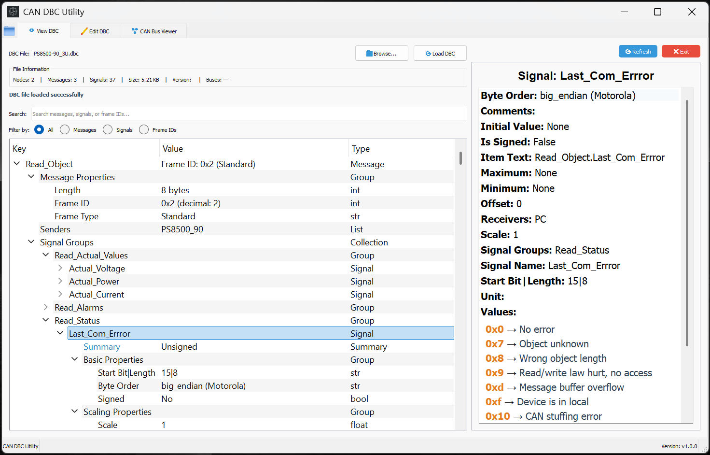

# DBC Utility — now part of BusAudit

DBC Utility is now maintained under the **BusAudit** ecosystem.
This repo contains the DBC Utility code. If you previously used the old repo, please update bookmarks, CI and remote to:
https://github.com/busaudit/dbcUtility

See pinned issue for more details.


<div align="center">
  
  <h1>DBC Utility</h1>
  <p>A PyQt5-based GUI application for viewing, editing, comparing, and managing CAN DBC files.</p>
</div>

## Features

### DBC File Viewer
- Browse and inspect CAN messages and signals in a hierarchical tree structure
- Detailed HTML view for selected message/signal properties
- File information panel: node count, message count, signal count, file size, version, buses
- Expand/Collapse all with one click

### DBC File Editor
- Full CRUD operations for messages and signals
- Add, edit, delete, duplicate, and reorder messages and signals
- Message properties: name, frame ID, length, bus type (CAN/CAN FD), senders, cycle time, frame type, protocol, comments
- Signal properties: name, start bit, length, byte order, signed/unsigned, scale, offset, min/max, unit, receivers, value table (choices), comments
- Save-review flow: changes go through a visual diff review before writing to disk
- Change tracking with detailed summary of added/deleted/modified items

### DBC Comparison Tool
- **Side-by-Side View**: Editable dual-panel diff with line numbers, character-level highlighting, and per-line directional copy arrows
- **Unified View**: Single-panel diff with +/- markers and "only changes" filter
- **Structured View**: Semantic comparison showing messages, signals, and properties in synchronized, editable side-by-side trees with color-coded diff status
- Swap, refresh, undo/redo, ignore whitespace, previous/next change navigation
- Save Primary / Save Secondary with dirty-state tracking and confirmation dialogs

### Multiplexer Support
- Full multiplexed signal handling across View, Edit, and Compare
- Signal classification: multiplexer, multiplexed, regular
- Multiplexer filter dropdowns for filtering signals by mux ID
- Multiplexer fields in Signal Edit dialog
- Mux validation with warnings for common configuration issues

### Message Signal Layout Visualizer
- Bit-level grid visualization of CAN/CAN FD message layouts (up to 64 bytes)
- Color-coded signal blocks with support for Little-endian (Intel) and Big-endian (Motorola) byte orders
- Signal name, bit position, and length annotations
- Multiplexer filter for multiplexed messages
- Accessible from both View and Edit tabs

### Advanced Search
- Unified search widget with real-time filtering
- View mode: filter by All, Messages, Signals, Frame IDs
- Edit mode: filter by All, Standard Frame, Extended Frame

### Home Screen
- Landing screen with recent files (up to 50), quick navigation to View/Edit tabs
- About dialog with app info, version, and links

## Screenshots

### View Tab - DBC File Browser

*Browse and inspect CAN messages and signals in a hierarchical tree structure*

### Edit Tab - DBC File Editor

*Full-featured editor for modifying messages and signals with intuitive controls*

## Project Structure

```
dbcUtility/
├── main.py                          # Application entry point
├── pyproject.toml                   # Project metadata and dependencies
├── src/                             # Source code
│   ├── DBCUtility.py                # Main window, View tab, app shell
│   ├── dbc_editor.py                # Core DBC processing logic (load/save/edit)
│   ├── dbc_editor_ui.py             # Edit tab UI, message/signal dialogs
│   ├── dbc_comparator.py            # Comparison engine (text diff, structured diff)
│   ├── dbc_comparator_ui.py         # Compare tab UI (side-by-side, unified, structured)
│   ├── multiplex_support.py         # Multiplexed signal classification and filtering
│   ├── message_layout_visualizer.py # Bit-level message layout grid
│   ├── home_screen.py               # Home screen and recent files
│   ├── about_dialog.py              # About dialog
│   ├── search_module.py             # Unified search widget
│   └── resource_utils.py            # Resource path resolution (dev + PyInstaller)
├── scripts/                         # Build and utility scripts
│   ├── build_exe.py                 # Windows PyInstaller build
│   ├── build_linux.py               # Linux distribution build
│   ├── release.py                   # Windows release script
│   ├── release_linux.py             # Linux release script
│   ├── clean_build.py               # Clean build directories
│   └── create_zip.py                # Archive creation
├── docs/                            # Documentation
│   ├── LINUX_BUILD_SETUP.md         # Linux build setup guide
│   └── CODEBASE_INDEX.md            # Codebase architecture reference
├── icons/                           # Application icons (app_icon.ico, app_icon.png)
├── images/                          # Screenshots for README
├── tests/                           # Test files
└── README.md
```

## Installation

### Windows
1. **Clone the repository**:
   ```bash
   git clone https://github.com/busaudit/dbcUtility.git
   cd dbcUtility
   ```

2. **Install UV** (if not already installed):
   ```bash
   pip install uv
   ```

3. **Install dependencies using UV**:
   ```bash
   uv sync
   ```

4. **Run the application**:
   ```bash
   uv run dbcUtility
   ```

### Linux
1. **Download Linux Distribution** (recommended):
   - Download `DBCUtility-Linux-x86_64-v1.0.3.tar.gz` from releases
   - Extract: `tar -xzf DBCUtility-Linux-x86_64-v1.0.3.tar.gz`
   - Install: `cd DBCUtility-Linux-x86_64-v1.0.3 && ./install.sh`

2. **Download AppImage** (alternative):
   - Download `DBCUtility-Linux-x86_64-v1.0.3.AppImage` from releases
   - Make executable: `chmod +x DBCUtility-Linux-x86_64-v1.0.3.AppImage`
   - Run: `./DBCUtility-Linux-x86_64-v1.0.3.AppImage`

3. **Build from source**:
   ```bash
   git clone https://github.com/busaudit/dbcUtility.git
   cd dbcUtility

   # Using UV (recommended)
   uv sync
   uv run python main.py

   # Or using pip
   pip install -r requirements.txt
   python main.py
   ```

4. **Build Linux Distribution** (for distribution):
   ```bash
   uv run python scripts/build_linux.py
   # See docs/LINUX_BUILD_SETUP.md for detailed instructions
   ```

5. **Create Complete Release**:
   ```bash
   uv run python scripts/release_linux.py
   ```

## Dependencies

- **PyQt5** (>=5.15.2) - GUI framework
- **cantools** (>=40.0.0) - DBC file parsing and manipulation
- **QtAwesome** (>=1.4.1) - Scalable vector icons (FontAwesome)
- **pyinstaller** (>=5.0.0) - For creating standalone executables

### Third-Party Licenses

| Library | License | Copyright |
|---------|---------|-----------|
| [PyQt5](https://www.riverbankcomputing.com/software/pyqt/) | GPL v3 | The Qt Company Ltd. |
| [cantools](https://github.com/cantools/cantools) | MIT | Erik Moqvist |
| [QtAwesome](https://github.com/spyder-ide/qtawesome) | MIT | Spyder IDE contributors |
| [PyInstaller](https://github.com/pyinstaller/pyinstaller) | GPL v2 with exception | PyInstaller Development Team |

## Usage

### Main Interface
The application provides a tabbed interface with four sections:

1. **View Tab**: Browse DBC files in a tree structure with search and multiplexer filtering
2. **Edit Tab**: Full editing capabilities for messages and signals with layout visualization
3. **Compare Tab**: Compare two DBC files side-by-side, unified, or in a structured semantic view
4. **CAN Bus Viewer**: Coming soon

### DBC Comparison Workflow
1. Select Primary and Secondary DBC files using the browse buttons
2. Click Compare to generate the diff
3. Switch between Side-by-Side, Unified, or Structured views
4. Edit content directly in the panels (Side-by-Side and Structured views)
5. Use the directional arrows to copy individual lines between panels
6. Save changes with the Save Primary / Save Secondary buttons

### Message Layout Visualization
1. Select a message in the View or Edit tab
2. Click "Visualize Layout" to open the bit-level grid
3. Signals are color-coded and annotated with name, start bit, and length
4. Use the multiplexer filter for multiplexed messages

## Development

### Code Structure

| Module | Purpose |
|--------|---------|
| `main.py` | Application entry point |
| `src/DBCUtility.py` | Main window, View tab, tab navigation |
| `src/dbc_editor.py` | Core DBC load/save/edit logic |
| `src/dbc_editor_ui.py` | Edit tab UI, message/signal edit dialogs |
| `src/dbc_comparator.py` | Text diff engine, structured semantic diff |
| `src/dbc_comparator_ui.py` | Compare tab UI (3 view modes) |
| `src/multiplex_support.py` | Multiplexer classification, filtering, validation |
| `src/message_layout_visualizer.py` | Bit-level CAN message grid |
| `src/home_screen.py` | Home screen, recent files manager |
| `src/about_dialog.py` | About dialog |
| `src/search_module.py` | Unified search widget |
| `src/resource_utils.py` | Resource path resolution |

### Building the Executable

```bash
# Windows
uv run python scripts/build_exe.py

# Linux
uv run python scripts/build_linux.py
```

The executable will be created in the `dist/` directory.

### Creating a Release

```bash
# Windows release
uv run python scripts/release.py

# Linux release
uv run python scripts/release_linux.py
```

This will:
- Build the executable
- Create a versioned release package
- Include all necessary documentation
- Generate release notes

Release packages are created in `release-v{version}/` (Windows) or `release-linux-v{version}/` (Linux).

### Testing

The `tests/` directory contains test files for:
- DBC file parsing and saving
- Comparison engine (text diff, structured diff)
- Signal and message manipulation
- Comment handling

## License

This project is licensed under the GNU General Public License v3 (GPL v3) - see the [LICENSE](LICENSE) file for details.

### License Summary

| Component | License |
|-----------|---------|
| DBC Utility | GPL v3 |
| PyQt5 | GPL v3 (compatible) |
| cantools | MIT (compatible) |
| QtAwesome | MIT (compatible) |
| PyInstaller | GPL v2 with exception (compatible) |

## Contributing

We welcome contributions! Please see our [Contributing Guidelines](CONTRIBUTING.md) for detailed information.

1. Fork the repository
2. Create a feature branch
3. Make your changes following our coding standards
4. Add tests if applicable
5. Submit a pull request with a clear description

---

**Simple. Clean. Working. Feature-rich DBC editor.**
